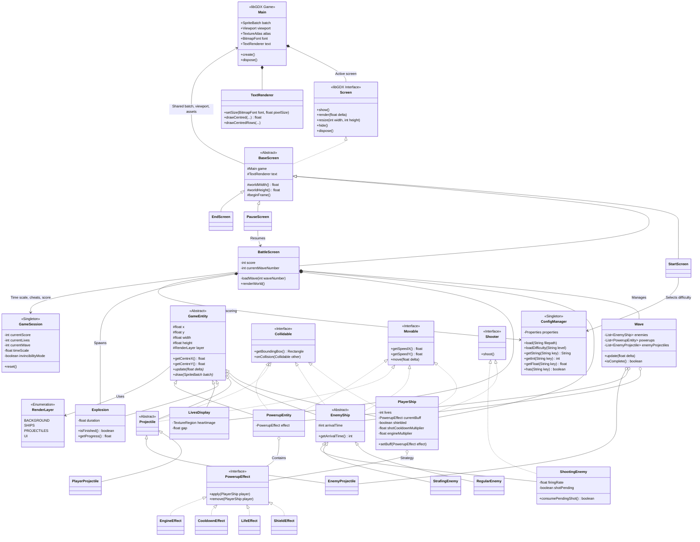

# Shadow Aliens

A retro top-down space shooter built with [libGDX](https://libgdx.com/). You pilot a
ship along the bottom of the screen and clear three waves of descending aliens: regular
ones dive straight down, strafing ones weave as they fall, and shooting ones fire back.
Powerups grant a shield, an extra life, a faster gun or a faster engine, one at a time.
Waves, enemy arrival times, scoring and difficulty all come from `.properties` files in
`assets/`, so the game can be retuned without recompiling.

**[Play it in your browser](https://jakeushida.github.io/shadow-aliens/)** (needs a keyboard).

## Controls

| Key | Action |
| --- | --- |
| `1` / `2` / `3` | Pick easy, medium or hard on the title screen |
| `A` / `D` | Move left and right |
| `SPACE` | Shoot (and restart from the end screen) |
| `ESC` | Pause and resume |
| `I` | Debug: toggle invincibility |
| `G` / `F` | Debug: speed time up and down |

## Design

The UML class diagram below describes the design of the game.

## Configuration

Gameplay is data-driven from `assets/`:

- `global.properties`: window size, background colour, and all on-screen text and layout.
- `easy.properties`, `medium.properties`, `hard.properties`: player stats, scoring, and the
  per-wave enemy and powerup tables. Selecting a difficulty reloads the globals and then
  layers the difficulty file on top.

Timing values such as `arrivalTime`, `player.shootCooldown` and `enemy.shooting.firingRate`
are counts of frames at 60fps (`GameSession.FRAMES_PER_SECOND`).

## Platforms

- `core`: main module with the application logic shared by all platforms.
- `lwjgl3`: primary desktop platform using LWJGL3; was called 'desktop' in older docs.
- `teavm`: web backend, compiled to JavaScript and published to GitHub Pages by
  `.github/workflows/deploy-pages.yml` on every push to `main`.

## Gradle

This project uses [Gradle](https://gradle.org/) to manage dependencies.
The Gradle wrapper was included, so you can run Gradle tasks using `gradlew.bat` or `./gradlew` commands.

Note that `gradle.properties` sets `org.gradle.logging.level=quiet`, so add
`-Dorg.gradle.logging.level=lifecycle` if you want to see task output.

Useful Gradle tasks and flags:

- `--continue`: when using this flag, errors will not stop the tasks from running.
- `--daemon`: thanks to this flag, Gradle daemon will be used to run chosen tasks.
- `--offline`: when using this flag, cached dependency archives will be used.
- `--refresh-dependencies`: this flag forces validation of all dependencies. Useful for snapshot versions.
- `build`: builds sources and archives of every project.
- `cleanEclipse`: removes Eclipse project data.
- `cleanIdea`: removes IntelliJ project data.
- `clean`: removes `build` folders, which store compiled classes and built archives.
- `eclipse`: generates Eclipse project data.
- `idea`: generates IntelliJ project data.
- `core:test`: runs the JUnit 5 unit tests.
- `lwjgl3:jar`: builds application's runnable jar, which can be found at `lwjgl3/build/libs`.
- `lwjgl3:run`: starts the desktop application.
- `teavm:buildRelease`: builds the JavaScript application into `teavm/build/dist/webapp`.
- `teavm:runRelease`: serves the JavaScript application at http://localhost:8080 via a local Jetty server.

Note that most tasks that are not specific to a single project can be run with `name:` prefix, where the `name` should be replaced with the ID of a specific project.
For example, `core:clean` removes `build` folder only from the `core` project.

---

A [libGDX](https://libgdx.com/) project generated with [gdx-liftoff](https://github.com/libgdx/gdx-liftoff).
